# AI Household Ledger Visual Screen Set V1

Status: generated and awaiting full-set visual review

Approved visual source: `05-home-approved.png`

All files are implementation references, not production image assets. Build the real interface with components, live backend data, responsive states, and accessible semantics after this set is approved.

## Gallery

| 01 Trust onboarding | 02 Financial baseline | 03 Goal setup |
| --- | --- | --- |
| 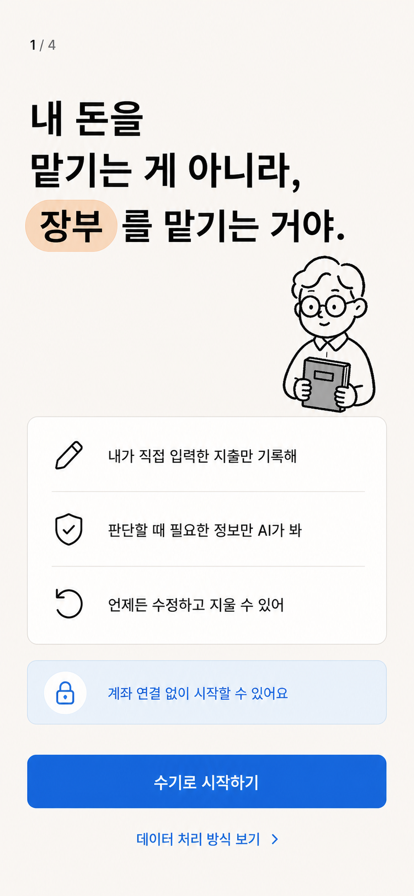 | 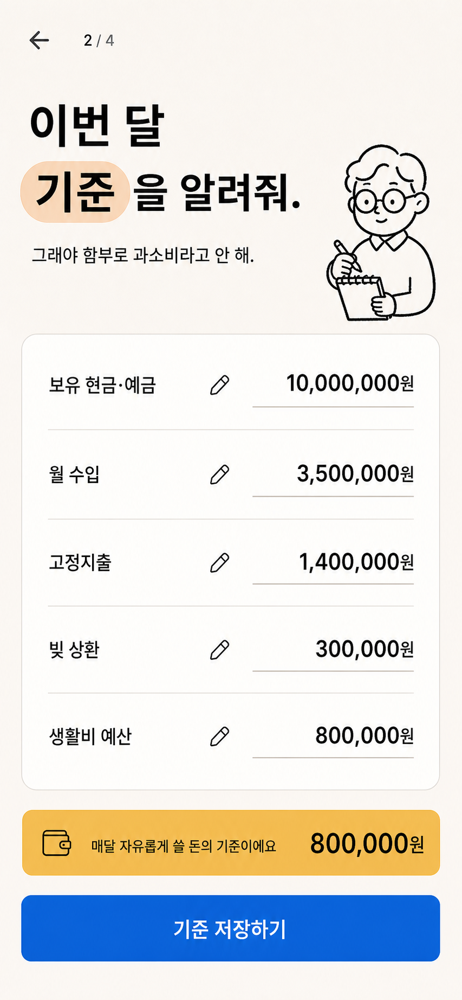 | 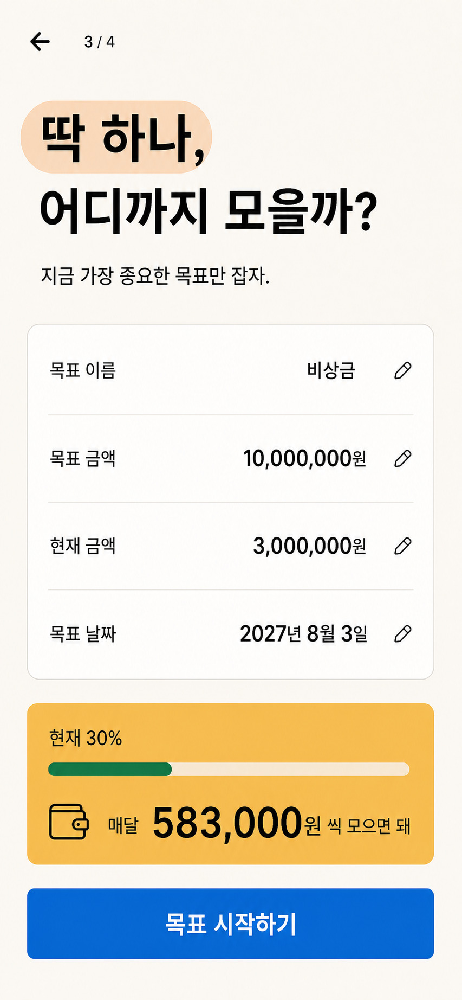 |

| 04 Data source | 05 Home | 06 Manual transaction |
| --- | --- | --- |
| 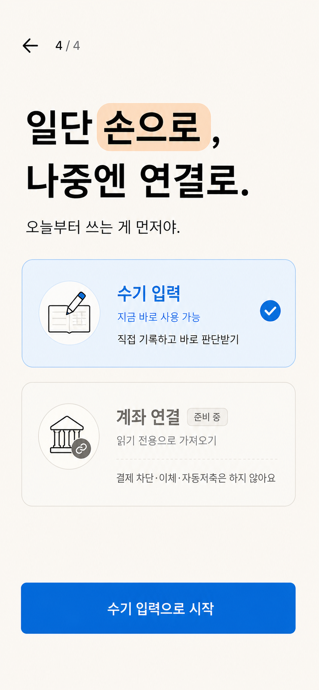 | 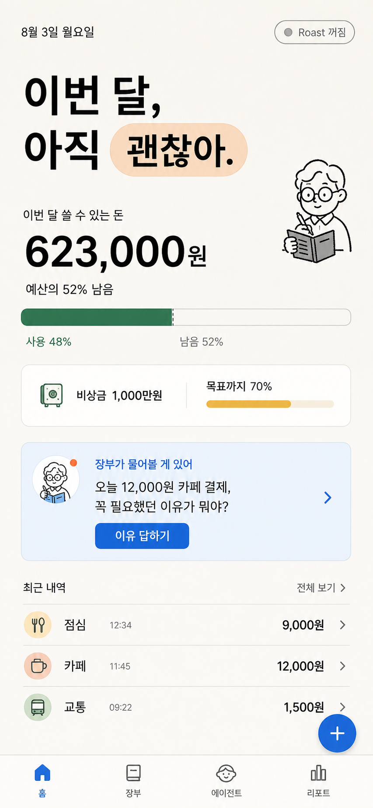 | 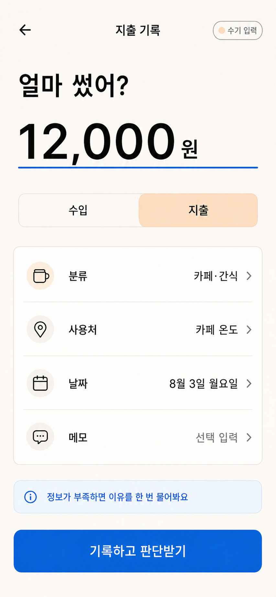 |

| 07 Reason question | 08 Normal judgment | 09 Roast judgment |
| --- | --- | --- |
| 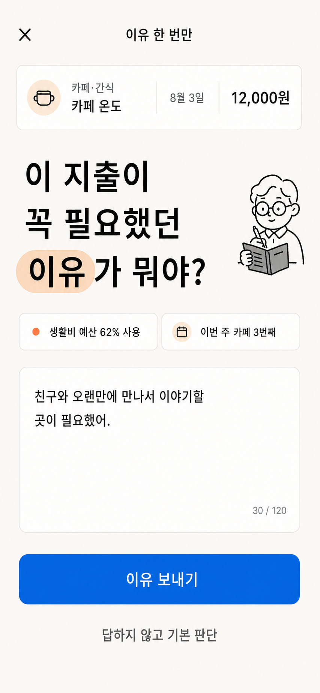 | 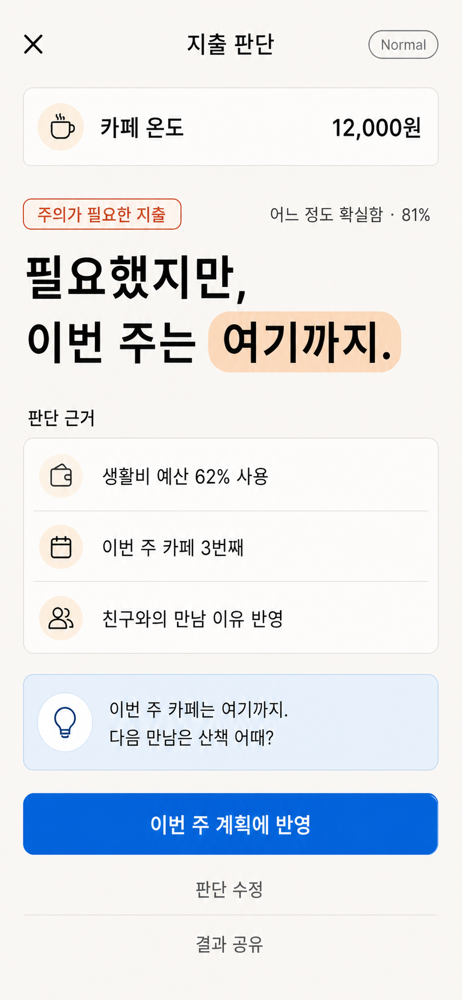 | 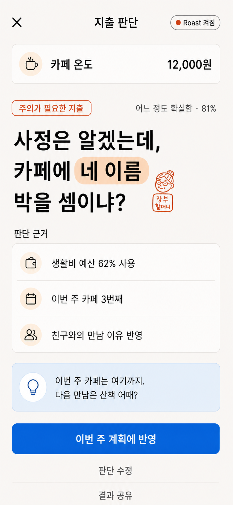 |

| 10 Ledger | 11 Transaction detail | 12 Agent inbox |
| --- | --- | --- |
| 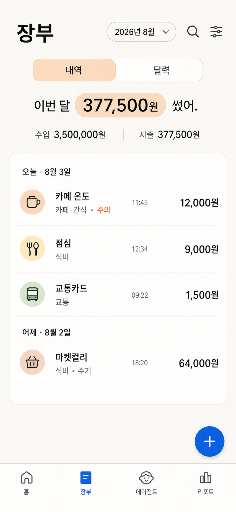 | 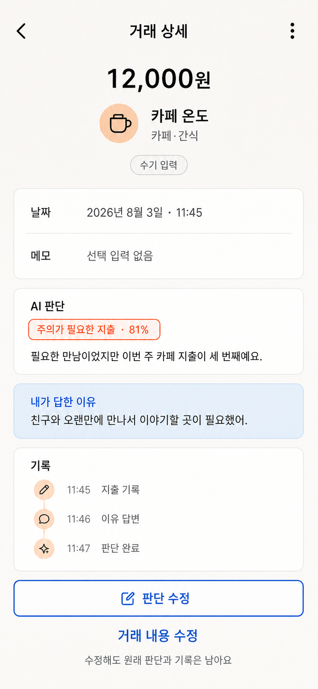 | 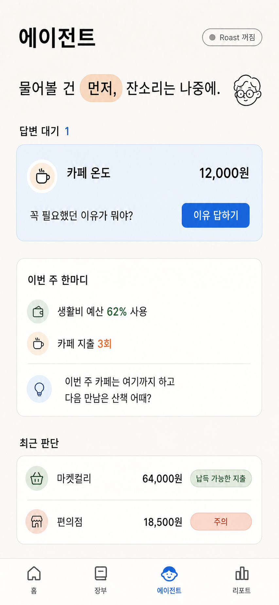 |

| 13 Monthly report | 14 Settings | 15 Share preview |
| --- | --- | --- |
| 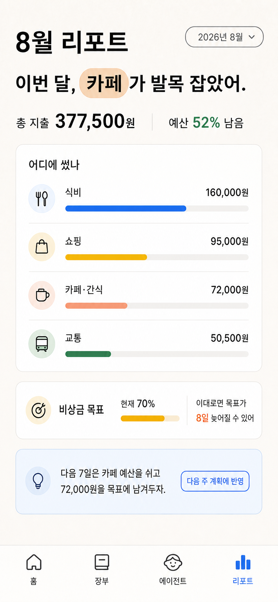 | 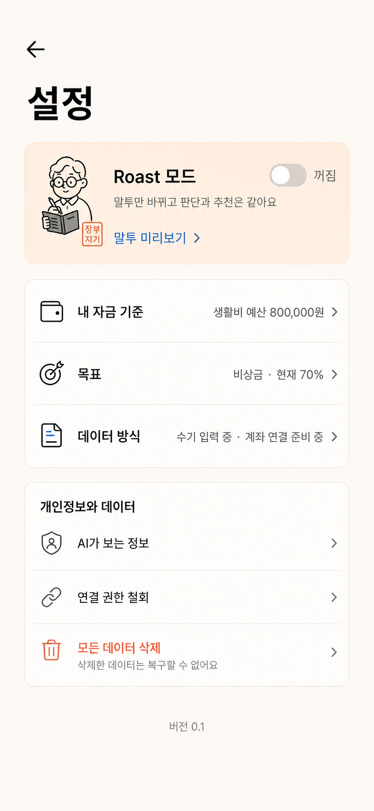 | 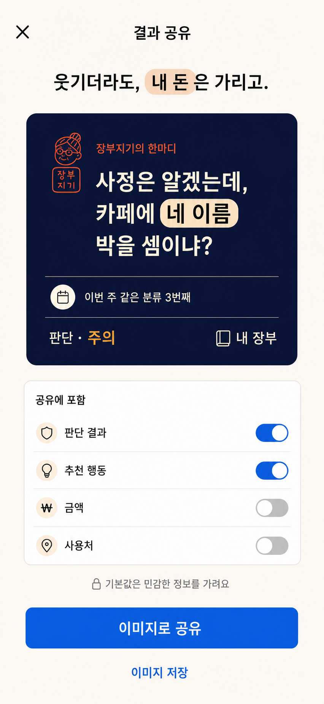 |

## Screen Contract

| # | File | Primary job | Primary action |
| --- | --- | --- | --- |
| 01 | `01-trust-onboarding.png` | Understand data handling and start without an account | 수기로 시작하기 |
| 02 | `02-financial-baseline.png` | Enter the financial baseline used for judgment | 기준 저장하기 |
| 03 | `03-goal-setup.png` | Define one active savings goal | 목표 시작하기 |
| 04 | `04-data-source.png` | Choose live manual entry while seeing future read-only connection | 수기 입력으로 시작 |
| 05 | `05-home-approved.png` | Understand this month and answer the next pending question | 이유 답하기 |
| 06 | `06-manual-transaction.png` | Record one expense quickly | 기록하고 판단받기 |
| 07 | `07-reason-question.png` | Add one missing piece of purchase context | 이유 보내기 |
| 08 | `08-judgment-normal.png` | Understand a Normal judgment and apply one correction | 이번 주 계획에 반영 |
| 09 | `09-judgment-roast.png` | See the same judgment in opt-in Roast presentation | 이번 주 계획에 반영 |
| 10 | `10-ledger.png` | Scan and open chronological records | Open transaction or add |
| 11 | `11-transaction-detail.png` | Inspect original evidence and append a correction | 판단 수정 |
| 12 | `12-agent-inbox.png` | Resolve pending questions before reviewing advice | 이유 답하기 |
| 13 | `13-monthly-report.png` | Identify one pattern and apply one adjustment | 다음 주 계획에 반영 |
| 14 | `14-settings.png` | Control Roast, financial context, source, and privacy | Open a setting row |
| 15 | `15-share-preview.png` | Review a redacted Roast share before publishing | 이미지로 공유 |

## Cross-screen Invariants

- Normal and Roast use the same transaction, `12,000원` amount, caution label, `81%` confidence, three evidence rows, recommendation, and primary action.
- Roast changes only the mode stamp and rendered headline.
- Manual entry is available now. Account connection is shown only as a future read-only capability.
- Financial amount and evidence outrank agent character decoration.
- The Agent screen starts with pending work, not a generic chat composer.
- Share preview hides amount and merchant by default.
- Ordinary expenses use ink. Coral is reserved for caution and Roast accents.

## Implementation Cleanup

Do not reproduce image-generation artifacts:

- Replace all slight blue-button and surface gradients with the flat tokens in `DESIGN.md`.
- Use one canonical bookkeeper illustration system; generated age, hair, and stamp details vary between screens.
- Keep at most one character mark per viewport unless a small repeated navigation icon is required.
- Treat `내 장부` as a working label until the product name is approved.
- Recreate every visible string as real Korean text and verify line breaks at 360px, 390px, and 430px widths.
- Use backend values for labels, confidence, evidence, and recommendations; do not embed the mock numbers in client logic.
- Add loading, empty, error, offline, focus, screen-reader, and reduced-motion states during implementation even though this gallery shows primary states only.

## Image QA

- Files present: 15/15
- Mobile aspect: all approximately 390:844
- Generated dimensions: 14 files at 853x1844; share preview at 852x1846
- Device chrome: absent
- Korean copy: visually reviewed for the primary screen contract
- Frontend implementation: not started
